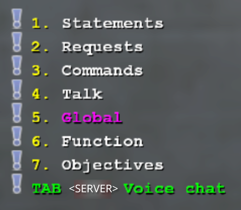
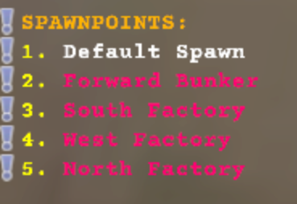
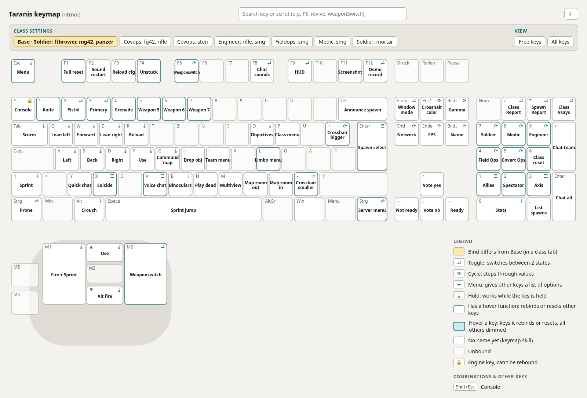
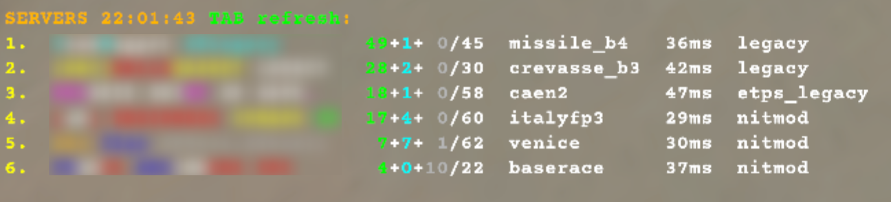

```
/////////////////////////////////////////////////////////////////
//                                                             //
//  ████████  █████  ██████   █████  ███    ██ ██ ███████ █    //
//     ██    ██   ██ ██   ██ ██   ██ ████   ██ ██ ██           //
//     ██    ███████ ██████  ███████ ██ ██  ██ ██ ███████      //
//     ██    ██   ██ ██   ██ ██   ██ ██  ██ ██ ██      ██      //
//     ██    ██   ██ ██   ██ ██   ██ ██   ████ ██ ███████      //
//                                            Wolfenstein:     //
//                                            Enemy Territory  //
//                                            Scripts & Tools  //
//                                                             //
/////////////////////////////////////////////////////////////////
```

[📖 Documentation](https://github.com/JoAllg/etlegacy-scripts/wiki)

Config, scripts and keybinds for **Wolfenstein: Enemy Territory** on **ET: Legacy**: one script set for every mod (legacy, nitmod, jaymod, etps; etpub, silEnT and ETJump with default values, not tested in game).

- **Class scripts:** class keys that step through the weapons of a class and set that class's binds.
- **Autoexecs** per map, team and mod, with a spawn menu for every map (`ENTER`).
- **Voice chat menu** (`V`) with colored texts.
- **[Server menu](#server-menu)** (`RIGHTCTRL`): your favorite servers with players, map and ping, a number key connects.
- **[Settings per server](#settings-per-server):** your own settings and the server's own voice chat, applied when you join it.
- **[Keymap](#keymap):** the live binds as a keyboard + mouse overview in the browser.

## Contents

- [Setup](#setup)
  - [Requirements](#requirements)
  - [Install](#install)
  - [deploy.sh](#deploysh)
  - [launcher.sh](#launchersh)
  - [Sound (OpenAL HRTF)](#sound-openal-hrtf)
- [In game](#in-game)
- [Tools](#tools)
  - [Keymap](#keymap)
    - [Live view while playing](#live-view-while-playing)
  - [Server menu](#server-menu)
  - [Settings per server](#settings-per-server)
- [Where things live](#where-things-live)
- [Developing](#developing)
  - [Agent skills](#agent-skills)

## Setup

### Requirements

- Linux
- ET: Legacy 2.86 or newer
- Python 3, only for the optional tools in `tools/`

Windows support is not planned, but only the setup is Linux-specific: the cfgs reach each other through the `profile/` and `profiles/` links instead of absolute paths, and machine-specific values live in `settings.conf`. A Windows port mainly needs a port of the existing shell scripts.

### Install

1. Clone the repo anywhere:

   ```sh
   git clone https://github.com/JoAllg/etlegacy-scripts.git
   cd etlegacy-scripts
   ```

2. Run [`deploy.sh`](#deploysh) and answer its questions:

   ```sh
   ./deploy.sh
   ```

3. Put your player name into `user.cfg` (name + the `PGDN` name cycle) and adjust fps, mouse, fov, refresh rate, fullscreen resolution and network rates. It is gitignored.

4. Start the game through [`launcher.sh`](#launchersh). The profile is `default`; the mod's `autoexec.cfg` runs the whole chain.

   ```sh
   ./launcher.sh [game arguments]    # e.g. ./launcher.sh +set fs_game nitmod +connect <ip>
   ./launcher32.sh [game arguments]  # 32-bit client, for i386-only mods
   ```

5. Optional, for headphones: [HRTF sound](#sound-openal-hrtf).

### deploy.sh

Rerun it after pulling and after moving the popups in the Legacy HUD editor (starting through `launcher.sh` does the same).

- **Game:** the first run detects the game (executable, fs_homepath, fs_basepath) and writes `settings.conf`, asking for anything it cannot find. Delete a line to detect it again.
- **Links:** links the repo into the mod folders. A `profiles/` folder the game already created in a mod folder blocks the link to this repo; the script offers to rename it to `profiles.bak_<date>`.
- **GUID keys:** backs them up and links them (`guid_backup/`).
- **`user.cfg`:** created from `user.example.cfg`. A rerun adds new `user.example.cfg` settings to your `user.cfg` and lists them.
- **HUD values:** rewrites the `HUD VALUES` block of `user.cfg` from your legacy HUD.
- **Desktop files (offered):** the application menu entries "ET: Legacy Launcher (64-bit)" and, with a 32-bit client installed, "(32-bit)", which start `launcher.sh` / `launcher32.sh` (`~/.local/share/applications/etlegacy-launcher.<arch>.desktop`). The 64-bit entry opens `et://` links.

### launcher.sh

Starts the game and handles everything around it. It needs a complete `settings.conf`.

Before the game starts:

- New maps get their spawn menu, the map autoexec `autoexec_<map>.cfg` (`tools/spawnpoints/spawnpoints.py`).
- Links and settings are refreshed without questions, each taking its safe default (`deploy.sh`).

Next to the game, until it exits:

- The in-game [server menu](#server-menu) stays up to date (`tools/servermenu.py`).
- Your [settings per server](#settings-per-server) apply when you join one (`tools/serverconfig.py`).
- The [live keymap](#live-view-while-playing) follows your class in the browser (`tools/keymap/live.py`).

The terminal shows only the warnings of these tools; the game's output is in `<fs_homepath>/<mod>/etconsole.log`.

Starting the game without `launcher.sh`: add `+set com_hunkMegs 512 +set com_zoneMegs 192 +set com_soundMegs 192` to its arguments (recommended, `launcher.sh` passes them). `com_zoneMegs` can only be set on the command line.

### Sound (OpenAL HRTF)

For headphones, HRTF places every sound in its exact direction including height (better than a virtual surround sink). Requires the OpenAL backend (`s_initsound 2`, set in `default/cvars.cfg`). Create `~/.config/alsoft.conf`:

```ini
[general]
channels = stereo
stereo-mode = headphones
stereo-encoding = hrtf
```

Output to the plain headphone device. Applies after `snd_restart`; check with `openal-info | grep -i hrtf`.

## In game

All binds, per class: open `tools/keymap/keymap.html` in a browser ([Keymap](#keymap)). The keys of the scripts:

| Key | Action |
| --- | --- |
| `F1` | full reset: runs `autoexec.cfg` again, toggles and cycles return to their start state |
| `F2` | restarts the sound (wrong sounds after a server change) |
| `F3` | re-execs the definitions and `user.cfg` (after a server enforced its own values) and keeps the current state of toggles and cycles |
| `F4` | fixes a stuck script state without touching settings: closes the open menu (voice chat, spawn menu, server menu), resets the class toggles (sniper mode, mortar map) and prone, and releases every held key (attack, sprint, movement, ...) |
| `F5` | cycles what `MOUSE2` does: switch to the first weapon, to the second weapon, or alt fire / reload |
| `V` | voice chat menu; `TAB` opens the [server's own](#settings-per-server) |
| `ENTER` | spawn menu of the map |
| `RIGHTCTRL` | [server menu](#server-menu) |
| `ESC` | closes the open menu |
| `HOME`, `END`, `PGUP`, `PGDN`, `DEL` | cycle crosshair color, FPS limit, gamma, name, network settings |
| `INS` | fullscreen ⇄ borderless window |

 

- On a map load the mod execs `autoexec_<mapname>.cfg` (spawnpoint menu); team and class autoexecs follow on respawn. Per-mod support: [`docs/autoexec.md`](docs/autoexec.md).

Console, commands, FPS/network settings, recoil and spread: [`docs/gameplay.md`](docs/gameplay.md).

## Tools

`launcher.sh` runs the helpers that have to run next to the game; the commands below start them on their own. All tools: [`tools/README.md`](tools/README.md).

### Keymap



A keyboard + mouse overview of the binds that are actually loaded, with short action names. The tool emulates the exec chain, presses every bound key and derives the views, toggles (⇄), cycles (⟳) and menus (☰) from what changes.

```sh
python3 tools/keymap/keymap.py              # writes tools/keymap/keymap.html (mod: KEYMAP_MOD in settings.conf)
python3 tools/keymap/keymap.py --mod legacy # other mod (mods bind different commands)
python3 tools/keymap/keymap.py --missing    # commands that still have no name
```

`keymap.html` is a single self-contained file. Tabs switch between Base and the class bind sets, hovering a key shows which keys it changes, the tooltip shows the raw command and its `file:line`. Rerun after changing binds; new commands get their names in `tools/keymap/labels.json`.

#### Live view while playing

```sh
python3 tools/keymap/live.py
```

Serves the page at <http://127.0.0.1:27999/>, opens the browser and follows the running game: picking a class switches to its tab, a reset returns to Base, a mod switch reloads the page for that mod. It keeps running across game restarts. Requires `logfile 2` (set in `default/cvars.cfg`). Details: [`tools/keymap/README.md`](tools/keymap/README.md).

### Server menu



`RIGHTCTRL` lists your favorite servers of the server browser in game, in aligned columns `name  playing+spectators+bots/slots  map  ping  mod` (playing humans green, spectators cyan, bots grey: `MENU_PLAYING`, `MENU_SPEC`, `MENU_BOTS` in `settings.conf`), sorted by playing humans. A number key connects, `TAB` shows the next page (or refreshes), `RIGHTCTRL` or `ESC` closes it.

```sh
python3 tools/servermenu.py
```

The game can't query servers from a script, so this helper has to run next to it: it asks the favorites every 5 seconds and writes the menu pages. The time in the menu heading shows how old the list is.

### Settings per server

Your own settings and the server's own voice chat, applied when you join it. The game can't tell a script which server it is on, so `tools/serverconfig.py` has to run next to it (`launcher.sh` starts it): it reads the console log and asks the server for its name. Details: [`docs/serverconfigs.md`](docs/serverconfigs.md).

Adding a server:

1. **Pick an id:** a short name for the server or the whole clan, e.g. `xy` for all servers with `[xY]` in their name. 1 to 4 characters of lowercase letters, digits and `_`. It names the server's files and an alias in game, so it can't be the clan tag itself (colors, spaces, brackets and `|` don't work there).

2. **Add the server:** join it, then run:

   ```sh
   python3 tools/serverconfig.py add <id>            # the server the game connected to last
   python3 tools/serverconfig.py add <id> <address>  # any other server
   ```

   This asks the server for its name, appends the row `<id><TAB><text in the server name>` to `default/serverconfigs/servers.tsv` and creates an empty `default/serverconfigs/<id>.cfg`. The text is the tag at the start of the name, which covers every server of the clan; `--match <text>` sets another one. If a clan renames its servers, only this text changes. Further rows for the same id are added by hand (format: `servers.example.tsv`).

3. **Settings (optional):** write them into `default/serverconfigs/<id>.cfg`. They override `user.cfg`. `default.cfg` runs before every server cfg and resets them on all other servers, so give each name you set its normal value there; this lists the ones you missed:

   ```sh
   python3 tools/serverconfig.py --check
   ```

4. **Voice menu (optional):** generate it from the server's pk3, which the game downloaded into the mod folder when you joined:

   ```sh
   python3 tools/voicemenu.py <id> <fs_homepath>/<mod>/<server pack>.pk3
   ```

   The pages go to `default/scripts/vsays/servers/<id>/`. Rerun it after the server ships a new pack; edited texts are kept.

5. **In game:** the settings apply on the next map load, team or class change, or with `F3`. `TAB` in the voice chat (`V`) opens the server's own menu.

`servers.tsv`, the server cfgs and the voice menu pages are gitignored.

## Where things live

| Path | Contents |
| --- | --- |
| `user.cfg` | personal settings, gitignored (template: `user.example.cfg`) |
| `settings.conf` | machine paths and color preferences, written by `deploy.sh`, gitignored |
| `default/` | the profile: `cvars.cfg`, `binds_*.cfg`, `definitions.cfg`, `state.cfg` |
| `default/scripts/` | class scripts, spawn menu, voicechat, general scripts |
| `default/mods/<mod>/` | per-mod `autoexec.cfg` and the values that differ per mod |
| `default/autoexecs/`, `default/maps/` | per-map spawnpoints and location name overrides |
| `default/serverconfigs/` | settings per server (`default.cfg`; your `servers.tsv` and `<id>.cfg` are gitignored) |
| `docs/` | mirrored to the [wiki](https://github.com/JoAllg/etlegacy-scripts/wiki) on push (`.github/workflows/wiki.yml`): game knowledge ([`gameplay.md`](docs/gameplay.md)), load order, scripting patterns, conventions, key names, colors, characters |
| `tools/` | keymap renderer, generators for spawnpoints and server voice menus, server menu and server settings helpers, nitmod stock shield ([`tools/README.md`](tools/README.md)) |

## Developing

Load order and mod support: [`docs/autoexec.md`](docs/autoexec.md). Script patterns and limits: [`docs/scripting.md`](docs/scripting.md). Naming and file conventions: [`docs/conventions.md`](docs/conventions.md).

- Syntax highlighting in VSCode: [quake2-config-syntax](https://marketplace.visualstudio.com/items?itemName=amokmen.quake2-config-syntax) and [quake2-config-theme-dark](https://marketplace.visualstudio.com/items?itemName=amokmen.quake2-config-theme-dark) (recommended by `.vscode/extensions.json`).
- Test changes: `F3` in game, `/condump <file>` saves the console.
- `INS` toggles fullscreen ⇄ borderless window at desktop resolution to reach the editor (`scripts/display.cfg`, runs `vid_restart`). `Alt + Enter` toggles fullscreen without a restart but keeps the resolution.

### Agent skills

The repo ships project skills in `.claude/skills/` (`.agents` links to `.claude`), usable by [Claude Code](https://claude.com/claude-code) and every agent that reads `.agents/skills/` (`/<name>` or picked up automatically):

| Skill | Use |
| --- | --- |
| `keymap` | regenerates `tools/keymap/keymap.html` and names new binds in `labels.json`; after bind, class script or menu layer changes |
| `vsay` | translates non-English voice chat pages, colors all vsay and chat texts and echo menus with the `VSAY_*` / `MENU_*` colors from `settings.conf`, previews and changes them, highlights key words; after `tools/voicemenu.py` or new vsay texts |
